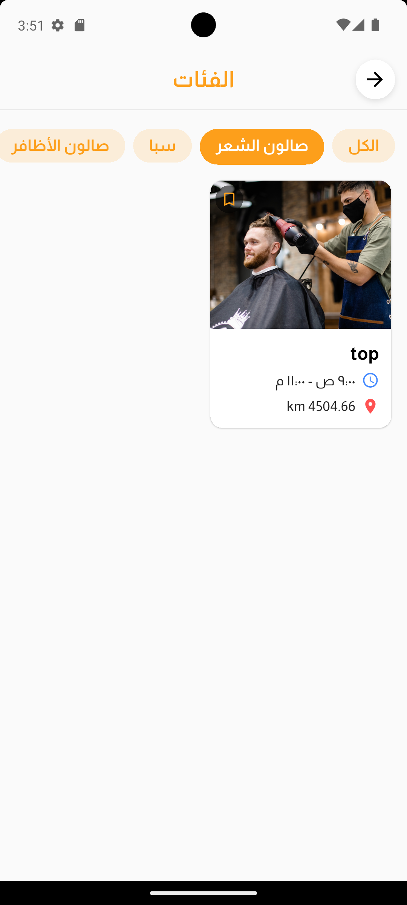

# 🏪 Salon Booking App

A comprehensive Flutter application that connects customers with beauty salons, enabling seamless appointment booking, real-time chat, and salon management.

## 📱 Screenshots

### 🎯 Onboarding & Authentication
| Splash Screen | Onboarding 1 | Onboarding 2 | Onboarding 3 |
|---------------|--------------|--------------|--------------|
|  |  |  |  |

| User Registration | Salon Registration | Login | Forgot Password |
|-------------------|-------------------|-------|-----------------|
|  |  |  |  |

### 🏠 User Home & Discovery
| User Home | All Categories | Category Salons | Saved Salons |
|-----------|---------------|-----------------|--------------|
|  |  |  |  |

### 📅 Appointments & Booking
| User Appointments | Salon Home | Completed Appointments | Cancel Appointments |
|-------------------|------------|------------------------|---------------------|
|  |  |  |  |

### 💬 Chat & Communication
| Chat List | Chat Interface |
|-----------|----------------|
|  |  |

### 👤 Profile & Settings
| User Profile | User Settings | Change Language | Change Password |
|--------------|---------------|-----------------|-----------------|
|  |  |  |  |

### 🏪 Salon Management
| Salon Profile | Salon Profile Details 1 | Salon Profile Details 2 | Salon Profile Details 3 |
|---------------|-------------------------|-------------------------|-------------------------|
|  |  |  |  |

| Edit Salon Profile | Salon Settings | Add Specialist | Add Package |
|-------------------|----------------|----------------|-------------|
|  |  |  |  |

### 🔔 Notifications
| Notifications |
|---------------|
|  |

## 🚀 Features

### 👥 User Features
- **User Registration & Authentication** - Secure signup/login with Firebase Auth
- **Salon Discovery** - Browse and search for nearby salons
- **Appointment Booking** - Book appointments with date/time selection
- **Real-time Chat** - Communicate with salons through in-app messaging
- **Push Notifications** - Get notified about appointments and messages
- **Profile Management** - Update personal information and preferences
- **Favorite Salons** - Save and manage favorite salon listings
- **Multi-language Support** - Arabic and English localization

### 🏪 Salon Features
- **Salon Registration** - Complete salon profile setup with services and packages
- **Appointment Management** - View, accept, and manage customer bookings
- **Service & Package Management** - Add and manage services and packages
- **Work Hours & Availability** - Set working hours and available time slots
- **Customer Communication** - Chat with customers and send notifications
- **Profile Customization** - Upload salon images and update information
- **Analytics Dashboard** - Track appointments and business metrics

### 💬 Communication Features
- **Real-time Messaging** - Instant chat between customers and salons
- **Message Types** - Text, audio, image, and video messages
- **Message Status** - Sent, delivered, and read receipts
- **Offline Support** - Messages sync when connection is restored
- **Push Notifications** - Real-time message notifications

### 🔔 Notification System
- **Appointment Reminders** - Automated appointment notifications
- **Message Alerts** - Instant chat message notifications
- **Status Updates** - Booking status change notifications
- **Custom Notifications** - Salon-initiated customer notifications

## 🛠️ Requirements

- **Flutter SDK** (>=3.0.5)
- **Dart SDK** (>=3.0.5)
- **Android Studio** or **VS Code**
- **Firebase Account** (for backend services)
- **Supabase Account** (for additional backend features)
- **Google Maps API Key** (for location services)

## 📦 Dependencies

### Core Dependencies
- `flutter_bloc` - State management
- `firebase_core` - Firebase initialization
- `firebase_auth` - User authentication
- `cloud_firestore` - Database operations
- `firebase_storage` - File storage
- `firebase_messaging` - Push notifications
- `supabase_flutter` - Additional backend services

### UI & Navigation
- `go_router` - App navigation
- `flutter_svg` - SVG image support
- `lottie` - Animation support
- `shimmer` - Loading animations
- `carousel_slider` - Image carousels

### Data & Storage
- `hive_flutter` - Local database
- `cached_network_image` - Image caching
- `geolocator` - Location services
- `google_maps_flutter` - Maps integration

### Media & Communication
- `image_picker` - Image selection
- `video_player` - Video playback
- `flutter_sound` - Audio recording/playback
- `record` - Audio recording
- `file_picker` - File selection

### Utilities
- `dio` - HTTP client
- `intl` - Internationalization
- `uuid` - Unique ID generation
- `equatable` - Value equality
- `dartz` - Functional programming

## ✅ Installation Steps

1. **Clone the repository:**
   ```bash
   git clone https://github.com/yourusername/salon-app.git
   cd salon-app
   ```

2. **Install dependencies:**
   ```bash
   flutter pub get
   ```

3. **Configure Firebase:**
   - Create a Firebase project
   - Add your `google-services.json` (Android) and `GoogleService-Info.plist` (iOS)
   - Enable Authentication, Firestore, Storage, and Cloud Messaging

4. **Configure Supabase:**
   - Create a Supabase project
   - Update the Supabase URL and anon key in `main.dart`

5. **Set up Google Maps:**
   - Get a Google Maps API key
   - Add it to your Android and iOS configurations

6. **Run the app:**
   ```bash
   flutter run
   ```

## 📂 Project Structure

```
lib/
├── core/
│   ├── constants/          # App constants and configurations
│   ├── extension/          # Dart extensions
│   ├── localization/       # Multi-language support
│   ├── themes/            # App theming and colors
│   ├── utils/             # Utility functions and helpers
│   └── widget/            # Reusable widgets
├── features/
│   ├── booking/           # Appointment booking system
│   ├── chat_feature/      # Real-time messaging
│   ├── favorite_salons/   # Favorite salon management
│   ├── home/              # Main home screen
│   ├── intro/             # App introduction screens
│   ├── notification/      # Push notification system
│   ├── profile/           # User profile management
│   ├── register/          # User registration and authentication
│   ├── salon_profile/     # Salon profile and management
│   ├── service/           # Service-related features
│   └── setting/           # App settings and configuration
└── main.dart              # App entry point
```

## 🧪 Running Tests

```bash
flutter test
```

## 📦 Building for Release

### Android APK:
```bash
flutter build apk --release
```

### Android App Bundle:
```bash
flutter build appbundle --release
```

### iOS:
```bash
flutter build ios --release
```

## 🌐 Localization

The app supports multiple languages:
- **English** (en)
- **Arabic** (ar)

To add new languages:
1. Add new ARB files in `lib/core/localization/l10n/`
2. Run `flutter gen-l10n` to generate localization files

## 🔧 Configuration

### Firebase Configuration
- Authentication: Email/Password
- Firestore: Database for users, salons, appointments
- Storage: Image and file storage
- Cloud Messaging: Push notifications

### Supabase Configuration
- Real-time database for chat messages
- Additional backend services

### Environment Variables
Create a `.env` file with:
```
FIREBASE_PROJECT_ID=your-project-id
SUPABASE_URL=your-supabase-url
SUPABASE_ANON_KEY=your-supabase-key
GOOGLE_MAPS_API_KEY=your-maps-key
```

## 🤝 Contributing

1. Fork the repository
2. Create a feature branch (`git checkout -b feature/amazing-feature`)
3. Commit your changes (`git commit -m 'Add amazing feature'`)
4. Push to the branch (`git push origin feature/amazing-feature`)
5. Open a Pull Request

## 📱 Screenshots

*Add screenshots of your app here*

## 📄 License

This project is licensed under the MIT License - see the [LICENSE](LICENSE) file for details.

## 🆘 Support

If you encounter any issues or have questions:

1. Check the [Issues](https://github.com/yourusername/salon-app/issues) page
2. Create a new issue with detailed information
3. Contact the development team

## 🔄 Version History

- **v1.0.0** - Initial release with core booking and chat features
- *Add more version history as needed*

---

**Built with ❤️ using Flutter**